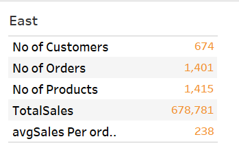

# Region Sales Comparison Project
---

## Objective:
---
Help the organization (Fictional Company) by creating a dashboard to visualize the sales comparison between two selected regions.

_Disclaimer : All datasets and reports do not represent any company, institution or country, but just the Super Store dataset to demonstrate capabilities of Tableau and to get my hands dirty._

# Problem Statements:
---
The director of a leading organization wants to compare the sales between two regions. He has asked each region operators to record the sales data to compare by region. The upper management wants to visualize the sales data using a dashboard to understand the performance between them and suggest the necessary improvements.

Steps to Perform: 

Select Sample Superstore as Dataset  

Use Sample Superstore Dataset

Select Data

Use Group by from Data Source Table on a Folder to create a folder to segregate the required data for Customer Name and Order ID inorder to organize the data thoroughly.

Create a hierarchy called Location for the variable Country. 

Create two parameters: Primary Region and Secondary Region with all regions listed in them. Here, primary and secondary region are the two regions where the sales are being compared.

Create Parameters for Primary Region and Secondary Region

Create a Calculated Field for both Primary Region and Secondary Region

Create a First Order Date

Create a Calculated Field and name it as the First Order Date

Create a dashboard

Align all sheets in the dashboard

Partition the dashboard to display the below details of Primary Region and Secondary Region

1) First Order Date
2) Total Sales
3) Average Sales per Order
4) No. of Customers
5) No. of Orders
6) No. of Products in Sale

# Skills/ Concepts demonstrated:
---
* Calculated Field
* Parameters
* Tooltip
* Path
* Label
* Filters
* Show me
* Hierarchy
* Group By

# Visualization
---

This report comprises 11 pages:
* Region Map
* Central Region Map
* East Map
* Central Min,Max & Total Sales
* East Min, Max & Total Sales
* Central Barchart
* East Barchart
* KPI-Central
* KPI- East
* Navigation botton
* Dashboard Container

You can interact with the report [here](https://public.tableau.com/app/profile/oluwole.fagbemi2492/viz/salescomparison_17091207051790/Dashboard1)
                                                                                   

# Analyses
---
East Region which comprises Connecticut,Delaware,District of Columbia,Maine,Maryland, Massachusetts,New Hampshire, New Jersey,New York, Ohio, Pennsylvania,Rhode Island, Vermont and West Virginia has the total sales of 678,781.

## East Map
---

The Central Region which comprises Illinois, Indiana, Iowa, Kansas, Michigan, Minnesota, Missouri, Nebraska, North Dakota,Oklahoma, South Dakota, Texas and Wisconsin has a total sales of 501,240

## Central Map
---

Taking a critical look at the Sub Categories for Central Region Copiers had the Maximum sales of 17500 with a total sale of 27,080 while Chairs had Maximum sales of 3505 and Total sales of 40,147.

## Max,Min & Total Sales
---

The East Region Sub Categories showed that 96,261 with a maximum sales of 4,416 while binders had 53, 498 of total sales and maximum sales of 4355

## Max,Min & Total Sales
---

Looking at the represented barchart from the Central Region Copier has the highest sales in the said region with 320

## Central Barchart
---

Also considering the sales in the East Region Copiers had the highest sales going by the Barchart.

## East Barchart
---

Having considered the sales activities in the Central Region I noted that having 629 customers, number of orders were 1175 and these customers ordered 1295 products which amounted to total sales of 501,240.

## KPI-Central
---

Having considered the sales activities in the East Region I noted that having 674 customers, number of orders were 1401 and these customers ordered 1415 products which amounted to total sales of 678,781.

## KPI- East
---

# Conclusion and Recommendation
---
The insight to where the organization has more advantage has been shown, this is where management should concentrate their effort in retaining the market share in the East Region while working vigorously on how to expand its Sales in the central Region.

